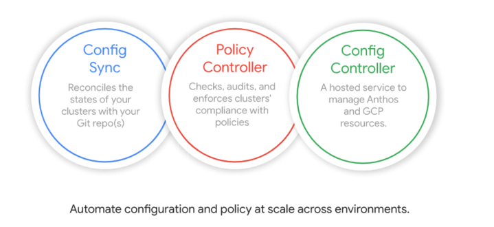
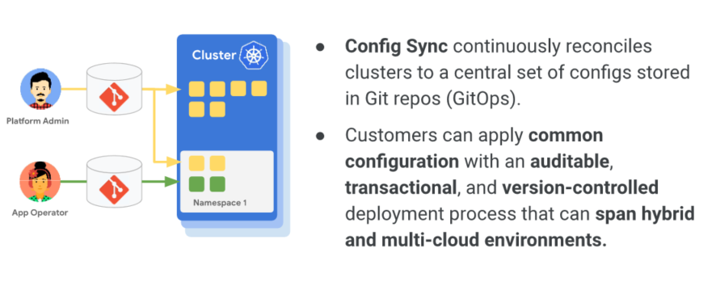
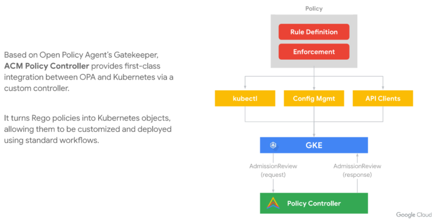
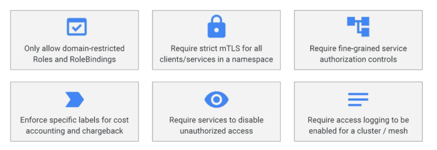

# Developer's guide

## Background Information

Shared Services Canada offers the GCP landing zone as-a-service. This landing zone follows ITSG-33 security requirements while implementing GCP best practices. This service can be leveraged by any Government of Canada entities to host their applications.

## Purpose

This guide will provide the necessary information that any Application Developer needs to sucessfully host a workload in the SSC landing zone and streamline the ATO process. 

## Technology Overview

SSC chose Anthos Config Management to manage the Infrastructure-as-code. ACM uses kubernetes config connector manifest to manage resources deployed in GCP. Most developer have some level of experience with kubernetes manifest file format and should not feel lost when looking, for the first time, at a kubernetes config connector resource definition.

### The Anthos Config Management components are 

### 1. Config Sync

Manifest files are stored and version controlled in a git repository.

A kubernetes operator running on the ACM kubernetes cluster called "Config Sync" observe that git repository and auto-magically apply all manifests following a GitOps process.

The Git deployment process looks like this

TODO: Selectors allow scoping objects to specific clusters

### 2. Policy Controller

Example of policy use cases

### 3. Config Controller

## Shared Services Canada - GCP Landing zone

SSC has built 4 distincts GCP organizations to isolate each environment from each other. The environments are experimentation, DEV, UAT and PROD.

### Experimentation

  This environment provides a great level of flexibility and autonomy to application developer. The objective is really to allow you to experiment any GCP services without requiring the implication of the platform administrator. 
  
  ### Cost

  This project is linked to a GCP billing account owned by **"your organization"**. 
  
  ### Permissions

  Your team gets granted `Editor` role on the GCP project. 
  
  ### Working with GCP

  Interaction with GCP is possible through the [cloud console](https://console.cloud.google.com/) or using [Gcloud SDK](https://cloud.google.com/sdk/docs/) from [Cloud Shell](https://cloud.google.com/shell/docs/) or any other Linux or windows computer, you can also interact with the GCP API directly. To do so, you authenticate with your Google Cloud Identity user account.

  ### Networking

  You project comes with an existing networking configuration. This configuration meets the 30 days [Guardrails](https://github.com/canada-ca/cloud-guardrails-gcp) requirements for experimentation (Guardrails 1,2,4,8,12)

  Below is the list of networking resources that have been deployed in your experimentation project :
  - VPC (flow logs enabled)
  - Subnets (Montreal and Toronto regions)
      - PAZ
      - APPRZ
      - DATARZ
  - Route to the internet (resources requires a tag)
  - Cloud NAT
  - DNS logging policy

  

### DEV, UAT and PROD

## Training
- GCP
    - Google Cloud Platform Fundamentals
    - Developing Applications with Google Cloud

- CCCS
    - Cloud Computing in the GC: The SA&A Process

## Links

1. https://cloud.google.com/config-connector/docs/reference/overview
